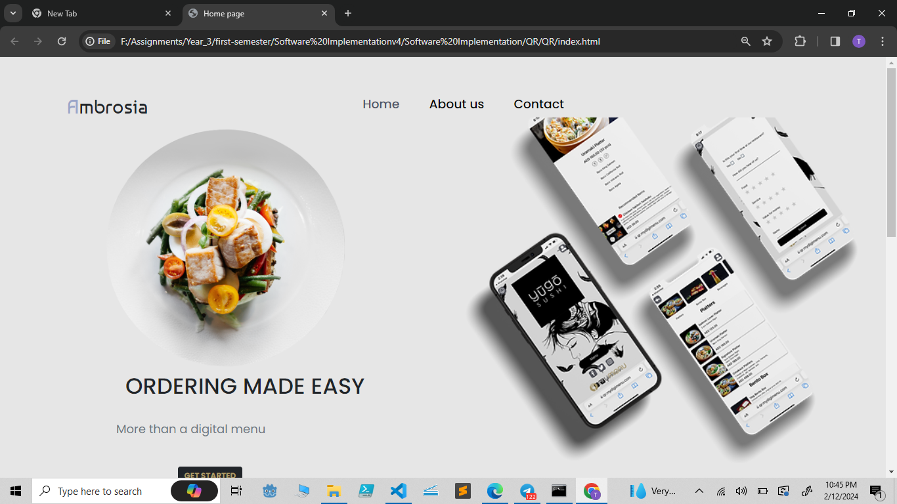
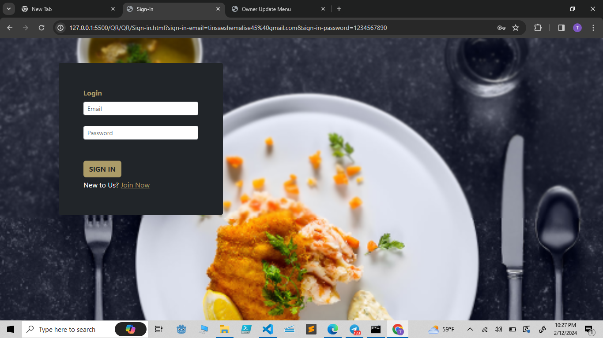
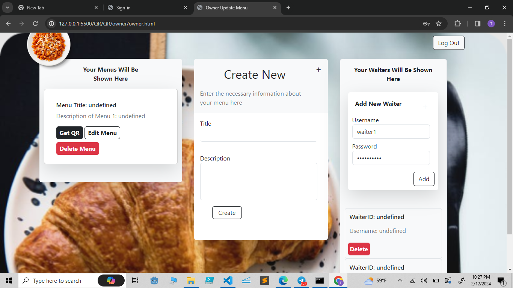
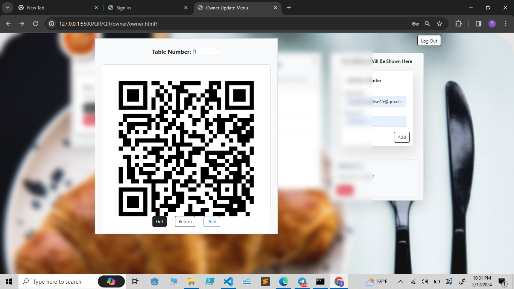
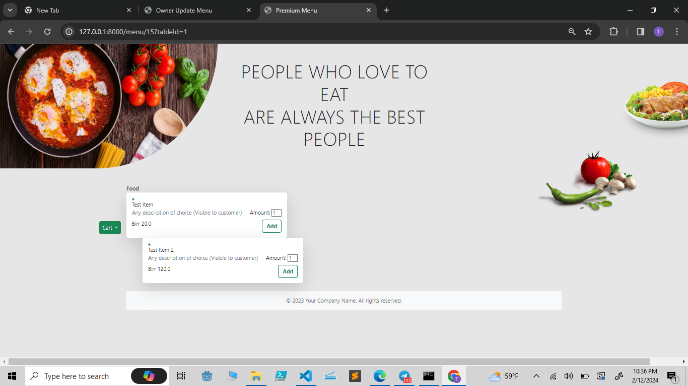
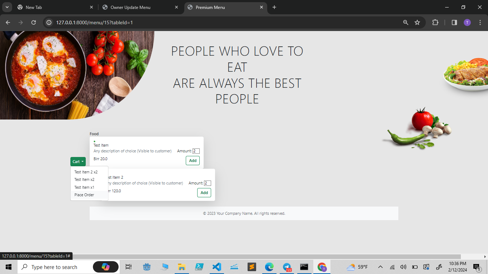
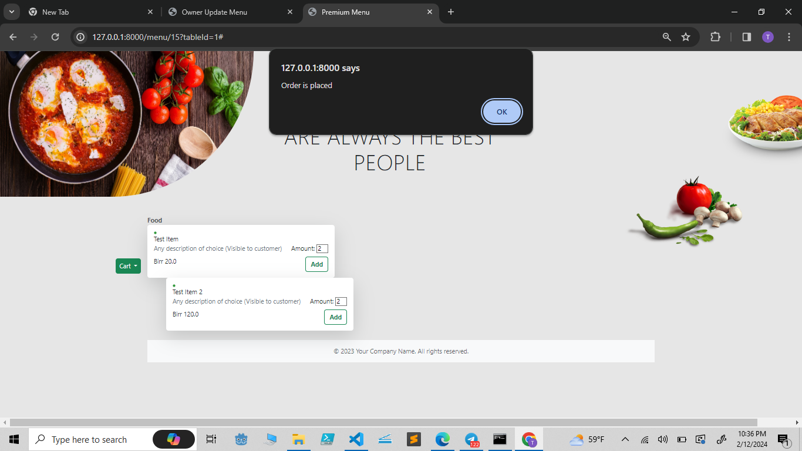
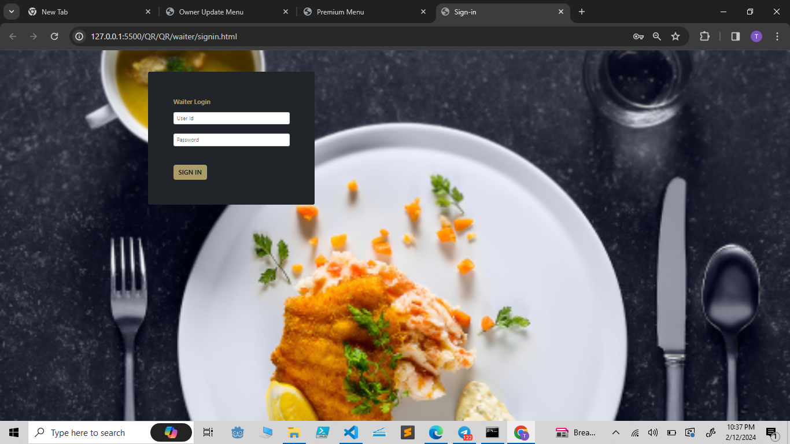
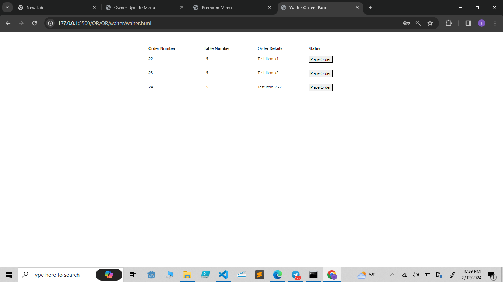

This is a product that helps restaurant owners to create modern QR based menus for their business.

### Business features:
---
* Creating custom menus for any business using templates ( Currently only 2 templates are available but can be added with ease)
* Change price and description (details) of menu items on the go
* Easily add/remove waiters from the system to enable/disable them from accepting orders
* Obtain and track detailed order information from any tabel

### Implementation Details
---
* Front-end
  - `Vanilla JS`  `html` `css` and `bootstrap` were used for building the front-end.

* Back-end
  - `FastAPI` : for buiding the API
  - `SQLite` : for the database
  - `Jinja2` : for creating a templating system for the menus
  - [`QR Code generator library`](https://www.nayuki.io/page/qr-code-generator-library#python) : for generating QR codes for menus to be put on a specific tabel 

### Ambrosia in action (Screen shots and their description)
---
### 1. Landing Page
   

### 2. Login Page
   
   
### 3. Ownern's Home Page
  Here the owner can:
  * `create a new menu`
  * `get the QR for a menu`
  * `Register\Remove a waiter from recieving orders`
  

### 4. Getting the QR Code of a menu
  * On the left we can see the QR code generated for the menu. It can easily be printed by pressing the print button.
  * On the right we can see the QR code being scanned using nothing but the camera app on an android phone. It gives the link to the menu which users can open any browser.
    
  &nbsp;&nbsp;&nbsp;&nbsp;&nbsp;&nbsp;&nbsp;

### 5. Menu from the customer's perspective
  * This is what the user will get when he/she scans the QR code and follows the link obtained. 
  

  * After adding items the can view their cart `Top` and place their order `Bottom`
  
   
  

### 6. Orders from the Waiters' perspective
  * Waiters must first login (On a secret page other than the main login page) using credentials given to them by the owner.
  

  * After loging in the waiters can see all the orders including from which table they are. So coordination of the waiting staff can be done easily.
  

    
